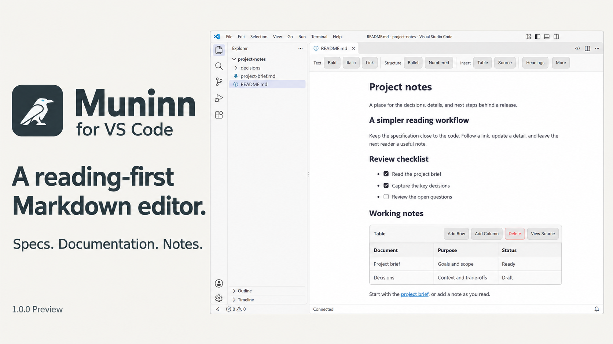

# Muninn for VS Code



A reading-first Markdown editor for specifications, documentation and notes. Read, follow links and make small changes in one pane while keeping ordinary Markdown files and useful Git diffs.

## Help shape the preview

Trying Muninn 1.0.0 Preview? Tell us where reading or editing Markdown feels awkward, or what would make it more useful. [Report a bug](https://github.com/bluecloud-dev/muninn-vscode/issues/new?template=bug_report.yml) or [suggest an improvement](https://github.com/bluecloud-dev/muninn-vscode/issues/new?template=feature_request.yml). When a Muninn editor is active, click **Muninn: Report issue** in VS Code's status bar to open the native issue reporter. You can also use **Help: Report Issue…** or **Muninn for VS Code: Report an Issue** from the Command Palette.

Please describe the task you were doing and the result you expected. Include steps to reproduce a bug when possible; remove private content from any sample Markdown or screenshots. Muninn does not collect feedback or usage data automatically.

## Start reading

The first release candidate is **1.0.0 Preview**, distributed on the pre-release channel. Install the pre-release extension and open a `.md` or `.markdown` file. If another editor is already your default, use **Reopen Editor With… → Muninn Markdown Editor**. Muninn respects your editor preferences.

- **Read and navigate:** comfortable line width, Unicode heading links, the native Headings picker, relative file links and VS Code Find.
- **Edit:** a compact toolbar with additional actions under More; standard GFM tasks and strikethrough; editable table cells with raw-source access.
- **Capture notes:** **Muninn for VS Code: New Markdown Note** uses the native file dialog. **Insert File Link** connects existing files with ordinary relative Markdown.
- **Review diagrams:** local, lazy-loaded Mermaid previews, gated by workspace trust.
- **Use Source:** open the same file in VS Code's Markdown text editor whenever you need the full source syntax.

Untouched files round-trip byte for byte in the regression corpus. Edits preserve surrounding source syntax; changes that cannot be mapped safely are rejected with a Source fallback. Conflicting external edits are preserved in a separate unsaved recovery document. Save and Source wait for pending rich edits. No proprietary note syntax or database is introduced.

## Settings

| Setting                                                  | Purpose                                                                    |
| -------------------------------------------------------- | -------------------------------------------------------------------------- |
| `muninn.toolbar.mode`                                    | Compact `basic` (default) or always-expanded `advanced`                    |
| `muninn.appearance.contentWidth`                         | `comfortable`, `full`, or 40–120 characters                                |
| `muninn.images.destination`                              | Image import folder relative to the document; default `images/`            |
| `muninn.integrations.mermaid.enabled`                    | Enable diagram previews                                                    |
| `muninn.integrations.mermaid.allowInUntrustedWorkspaces` | Explicit user-level permission to render in Restricted Mode; default false |

The old `muninn.editorAssociations` setting is deprecated and has no effect. Configure defaults with VS Code's editor picker.

Remote images do not load automatically. Imported images are limited to 10 MiB. Markdown HTML stays disabled. The extension makes no telemetry calls. Desktop VS Code 1.85.2+ is supported; browser/vscode.dev support is not advertised.

## Development

Use Node 24. The [contributor documentation](docs/README.md) is the current source of guidance for humans and AI agents. Start with [Getting started](docs/GETTING_STARTED.md), [Architecture](docs/ARCHITECTURE.md), [Development](docs/DEVELOPMENT.md), and [Testing](docs/TESTING.md). The [audit implementation](docs/AUDIT_IMPLEMENTATION_2026-09.md) records an earlier validation snapshot.

```bash
npm ci
npm run compile
npm run bundle
npm run coverage
npm test
npm run package
npm run test:e2e
```

F5 runs the checked-in compile/bundle task. Packaging produces a minified pre-release VSIX and third-party notices; the UI suite tests that exact archive.

[Security policy](SECURITY.md) · [Security posture](docs/SECURITY_POSTURE.md)

## License

GNU Affero General Public License v3.0 (AGPL-3.0-only). See [LICENSE](LICENSE).

### License — plain language

Using Muninn to edit files imposes nothing on those files, your employer's code, or any repository you open.
Your markdown, and anything you write with Muninn, is yours.
The AGPL governs copying, distributing, or modifying Muninn itself.
If you distribute a modified Muninn, share it under the same license and keep required notices.
If you serve a modified Muninn through hosted VS Code environments such as code-server, Codespaces, or Gitpod, offer users the source for that modified Muninn.
Redistributing unmodified Muninn keeps the [LICENSE](LICENSE) and notices with the extension.
Common-understanding summary, not legal advice; the [LICENSE](LICENSE) text governs.
